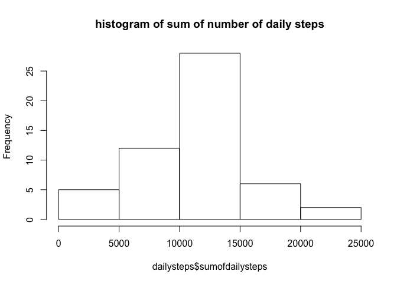
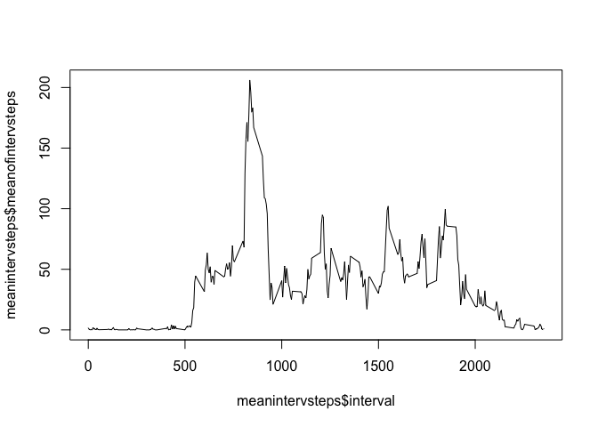
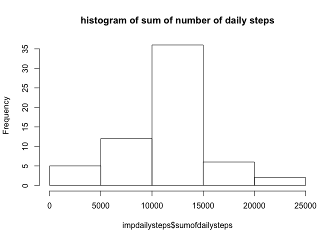
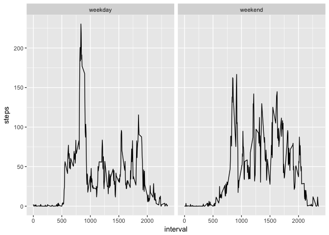

# Reproducible Research: Peer Assessment 1


## Loading and preprocessing the data

```r
fileUrl <- "https://d396qusza40orc.cloudfront.net/repdata/data/activity.zip"
download.file(fileUrl, destfile="./RepResActivity.zip")
unzip("./RepResActivity.zip")
activity <- read.csv("activity.csv")
activity$date <- as.Date(activity$date, "%Y-%m-%d")
# looking at the structure:
str(activity)
```

```
## 'data.frame':	17568 obs. of  3 variables:
##  $ steps   : int  NA NA NA NA NA NA NA NA NA NA ...
##  $ date    : Date, format: "2012-10-01" "2012-10-01" ...
##  $ interval: int  0 5 10 15 20 25 30 35 40 45 ...
```


## What is the mean total number of steps taken per day?

```r
# aggregating steps per day for mean and median calculation
dailysteps <- aggregate(activity$steps, by=list(Date = activity$date), sum)
colnames(dailysteps)[2] <- "sumofdailysteps"

hist(dailysteps$sumofdailysteps, main = "histogram of sum of number of daily steps")
```

<!-- -->

```r
mean(dailysteps$sumofdailysteps, na.rm = TRUE) # mean of daily steps
```

```
## [1] 10766.19
```

```r
median(dailysteps$sumofdailysteps, na.rm = TRUE) # median of daily steps
```

```
## [1] 10765
```


## What is the average daily activity pattern?

```r
meanintervsteps <- aggregate(activity$steps, by=list(interval = activity$interval), mean, na.rm = TRUE)
colnames(meanintervsteps)[2] <- "meanofintervsteps"
plot(x=meanintervsteps$interval, y=meanintervsteps$meanofintervsteps, type = 'l')
```

<!-- -->

```r
max(meanintervsteps)
```

```
## [1] 2355
```

```r
which.max(meanintervsteps$meanofintervsteps)
```

```
## [1] 104
```

```r
meanintervsteps[104,]
```

```
##     interval meanofintervsteps
## 104      835          206.1698
```
The maximum is inside row 104, so it's the interval 835 -> looking at the plot this seems to be correct


## Imputing missing values

```r
impactivity <- activity # new data set which will get imputed data
sum(is.na(impactivity$steps)) # checking how many NAs there are right now
```

```
## [1] 2304
```

```r
for(i in 1:(nrow(impactivity))) { # replacing each NA with the mean of the corresponding interval
    if(is.na(impactivity$steps[i])) {
        impactivity$steps[i] = meanintervsteps$meanofintervsteps[meanintervsteps$interval==impactivity$interval[i]]
    }
}
# check if an na is left
sum(is.na(impactivity$steps))
```

```
## [1] 0
```

```r
#### Recalculating the daily steps, the histogram and mean and median for the data set with imputed data
impdailysteps <- aggregate(impactivity$steps, by=list(Date = impactivity$date), sum)
colnames(impdailysteps)[2] <- "sumofdailysteps"

hist(impdailysteps$sumofdailysteps, main = "histogram of sum of number of daily steps")
```

<!-- -->

```r
mean(dailysteps$sumofdailysteps, na.rm = TRUE) # before imputing
```

```
## [1] 10766.19
```

```r
median(dailysteps$sumofdailysteps, na.rm = TRUE) # before imputing
```

```
## [1] 10765
```

```r
mean(impdailysteps$sumofdailysteps, na.rm = TRUE) # after imputing
```

```
## [1] 10766.19
```

```r
median(impdailysteps$sumofdailysteps, na.rm = TRUE) # after imputing
```

```
## [1] 10766.19
```
The means stay the same - median changes a bit and is now equal to mean


## Are there differences in activity patterns between weekdays and weekends?

```r
impactivity$daytype <- weekdays(impactivity$date)
for(i in 1:nrow(impactivity)) {
    if(impactivity$daytype[i] == "Samstag" || impactivity$daytype[i] == "Sonntag") {
        impactivity$daytype[i] <- "weekend"
    } else {
        impactivity$daytype[i] <- "weekday"
    }
}
impactivity$daytype <- as.factor(impactivity$daytype)

impmeanintervsteps <- aggregate(steps ~ interval + daytype, impactivity, mean)
library(ggplot2)
qplot(x = interval, y = steps, data = impmeanintervsteps, geom = ("line")) + facet_grid(~ daytype)
```

<!-- -->
